# **Ejemplo Práctica 3**

Este ejemplo incluye algunas de las funcionalidades requeridas en la **Práctica 3** del proyecto. Se trata de una página web desarrollada con **React y React Router**, que consume una **API REST** implementada en la **Práctica 2**.

Además, en esta implementación se ha utilizado **Zustand** para la gestión de estado global (usuario/sesión) y `clientLoader` en las rutas junto con un **spinner global** para mostrar estados de carga de forma consistente en toda la aplicación.

---

## **Ejecución del backend**

Para que la aplicación React funcione correctamente, primero es necesario ejecutar el backend (**una API REST implementada con Spring Boot**).

El código del backend se encuentra en la carpeta **`backend`**.

Se puede ejecutar desde un IDE (Eclipse, Visual Studio Code, IntelliJ...) o desde la línea de comandos con Maven:

```sh
$ cd backend
$ ./start_db.sh
$ mvn spring-boot:run
```

## Ejecución del frontend (en modo desarrollo)

Nos ubicamos en la carpeta del frontend:

```bash
$ cd frontend
```

Instalamos las dependencias:

```bash
$ npm install
```

Ejecutamos la aplicación en modo desarrollo:

```bash
$ npm run dev
```

Una vez que en la consola aparezca que el servidor está listo, podemos acceder a la aplicación React en:

* 🔗 `http://localhost:5173/`

El servidor de desarrollo evita problemas de CORS usando un proxy de Vite configurado en [frontend/vite.config.ts](frontend/vite.config.ts).

## Diagrama de elementos

```mermaid
flowchart LR
  H[Home]

  subgraph R[Routes]
    direction LR
    L[BookList]
    D[BookDetail]
    E[BookEdit]
    N[BookNew]
    NF[NotFound]
  end

  subgraph C[Components]
    F[BookForm]
    HD[Header]
  end

  subgraph S[Services]
    BS[BooksService]
    SS[ShopsService]
    LS[LoginService]
  end

  ST[UserStore]

  H --> R
  R --> C
  R --> S
  C --> S
  S --> ST

  L --> D
  D --> L
  D --> E
  L --> N
  N --> D
  E --> D

  classDef home fill:#b8e0d2,stroke:#2f7a63,stroke-width:1px,color:#111827,font-size:22px
  classDef route fill:#c7d0db,stroke:#4b5563,stroke-width:1px,color:#111827,font-size:22px
  classDef component fill:#e5d4ef,stroke:#7c3aed,stroke-width:1px,color:#111827,font-size:22px
  classDef service fill:#93c5fd,stroke:#2563eb,stroke-width:1px,color:#111827,font-size:22px
  classDef store fill:#ecd98b,stroke:#8b7a2f,stroke-width:1px,color:#111827,font-size:22px

  class H home
  class D,L,N,E,NF route
  class F,HD component
  class BS,SS,LS service
  class ST store

  style R fill:#f3f4f6,stroke:#d1d5db,color:#111827
  style C fill:#f3f4f6,stroke:#d1d5db,color:#111827
  style S fill:#f3f4f6,stroke:#d1d5db,color:#111827
  linkStyle default stroke:#111111,stroke-width:1.5px
```



## Distribución con el backend

Para desplegar correctamente la **Práctica 3**, es necesario **compilar** la aplicación React y copiar los archivos generados en la carpeta de archivos estáticos del backend.